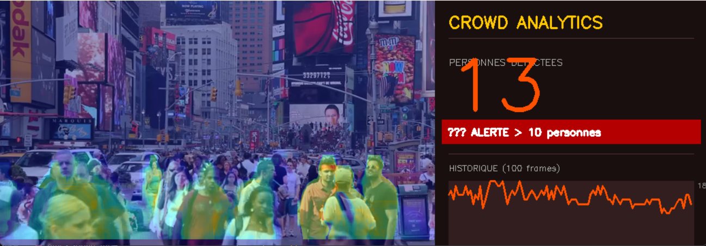

# YOLOv8 Segmentation & Crowd Analytics

This project explores real-time object detection and segmentation using YOLOv8.
Starting with bounding boxes and pixel-level segmentation, then moving to crowd density analysis with live heatmaps and a real-time dashboard.
Built with Python 3.14, YOLOv8, OpenCV and NumPy.

## Demo

